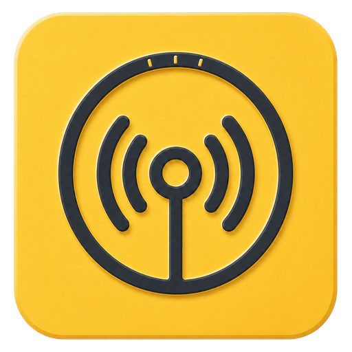

  

<h1 align="center">Radio Vault</h1>

<strong>Bring your old radio collection back to life.</strong>

Radio Vault turns folders full of old radio recordings into a collection you can actually enjoy again.

If your archive has grown across hard drives, copied folders and years of inconsistently named files, Radio Vault gives it a home. It brings your recordings together in one searchable library, organises them around shows and broadcasts, and lets you listen from your computer, phone or tablet.

Your collection stays on your own hardware and remains under your control.

## Rediscover the radio you saved

Old radio collections are often difficult to explore. A single broadcast may be split across several files. Dates may be incomplete. The same recording may appear more than once, and finding a particular guest or conversation can mean searching through hundreds of filenames.

Radio Vault is designed for exactly this kind of archive. It helps you:

- browse your collection by show, year, month and broadcast;
- bring multi-part recordings together as one listening experience;
- search for shows, guests, topics and words spoken in transcripts;
- separate broadcasts from duplicate files and alternative recordings;
- keep undated or uncertain recordings visible instead of losing them;
- see what you have listened to and what is still waiting to be heard.

Radio Vault has especially deep recognition for collections containing shows such as **Ron & Fez**, **Bennington**, **Opie & Anthony**, **The Ron & Ron Show**, **Ron Bennington Interviews** and **Unmasked**, while its library is designed to hold other radio collections too.

## Made for listening

Radio Vault is not just a catalogue. It is a full player for long-form radio.

- Start a broadcast on one device and continue from the same place on another.
- Pause today and return days later without losing your position.
- Play multi-part recordings on one continuous timeline.
- Build an Up Next queue for long listening sessions.
- Mark broadcasts as favourites, played or still to be heard.
- Save memorable points as Moments so you can return to them later.
- Download broadcasts to your phone or computer for offline listening.
- Control playback from the iPhone lock screen and Control Centre.

When another device is already playing, Radio Vault can hand playback over deliberately, keeping the same broadcast and listening position.

## A library that feels like a collection

The Dashboard gives you a quick way back into your archive, including recently played broadcasts, listening progress and suggestions from your own collection.

The Library lets you move naturally from shows to years, months and individual broadcasts. Search helps you find a date, guest or topic without remembering the original filename. Filters make it easy to hide completed shows or concentrate on recordings you have not heard yet.

Artwork, broadcast details, favourites, listening history and saved Moments stay connected to the broadcast wherever you listen.

## Explore the stories inside your archive

For collections that deserve more than a list of files, Radio Vault includes an Explore area inspired by an encyclopaedia.

You can build pages about shows, people, topics and eras; connect them to broadcasts; add images, sources and timelines; and move between related pages as you would on a wiki. Transcripts make spoken content searchable and help turn a large audio archive into something you can research as well as hear.

These features are optional. Radio Vault remains useful as a straightforward organiser and player even if you never create a transcript or an Explore page.

## Listen around your home

One Windows computer runs **Radio Vault Server** and looks after the main collection. You can then use Radio Vault from:

- the full Windows desktop client;
- the Apple Silicon Mac client;
- the native iPhone and iPad app;
- Radio Vault Web in a browser on your local network.

Pairing a device is designed to be simple: create a pairing code in Settings, enter it on the new device, and the same library becomes available there.

## Private by design

Radio Vault is made for personal archives. Your recordings, listening history, transcripts and research stay on the computers and devices you control. The current version is intended for use on a private home network and should not be exposed directly to the public internet.

Radio Vault does not require you to upload your collection to a streaming service or hand it over to a third-party media library.

## Current availability

Radio Vault is under active development and is currently an **alpha** release.

- Radio Vault Server runs on Windows.
- The Windows client provides the complete desktop experience.
- The Apple Silicon Mac client connects to the same server and library.
- The native iPhone and iPad client supports browsing, playback, downloads, Up Next and handoff.
- Radio Vault Web provides convenient access from other browsers on the same network.

The project is already suitable for hands-on testing with a real collection, but installers and features are still being refined before a wider public release.

## Download the latest test builds

New test builds are created automatically whenever Radio Vault is updated. Use the links below, open the newest run with a green tick, then scroll to **Artifacts** and choose the download for your device.

- [Windows client and server](https://github.com/GHRobson/TheRadioVault/actions/workflows/ci.yml?query=branch%3Amain) — choose `windows-client-and-server`.
- [Mac client for Apple Silicon](https://github.com/GHRobson/TheRadioVault/actions/workflows/ci.yml?query=branch%3Amain) — choose `macos-client-osx-arm64-unsigned`.
- [iPhone and iPad simulator build](https://github.com/GHRobson/TheRadioVault/actions/workflows/ci.yml?query=branch%3Amain) — choose `ios-client-simulator-arm64-unsigned`.

These are alpha test builds rather than finished public installers. Because the repository is currently private, GitHub will ask you to sign in before downloading them. The iPhone and iPad download is for Apple's simulator; installing Radio Vault on a physical device still requires signing through Xcode.

## Getting started

1. Install Radio Vault Server on the Windows computer that holds your collection.
2. Add the folders containing your radio recordings.
3. Install Radio Vault on the computers and phones where you want to listen.
4. Pair each device with the server and start exploring your library.

See [Building and installation](BUILDING.md) for the current installation options and [Using the Mac client](MACOS-CLIENT.md) for Mac-specific guidance.

## About the project

Radio Vault grew from a simple idea: old radio recordings should feel like a living collection, not forgotten files in a folder.

The Windows Server, Windows client, Mac client, iPhone and iPad app, and browser experience are maintained together in this repository so that the library and listening experience can stay consistent across every device.

For contributors, [DEVELOPMENT.md](DEVELOPMENT.md) explains the shared development workflow. Earlier release and acceptance notes are preserved in the [historical release archive](docs/history/release-notes/README.md).

## AI disclosure

Radio Vault has been designed and developed with extensive assistance from generative AI tools. AI has helped turn the creator's ideas into interface designs, code, tests and documentation. The direction of the product and hands-on testing remain human-led.

The Radio Vault application does not contain a generative-AI assistant and does not send your recordings, library or listening history to an AI service. Its everyday organising and playback features work without AI. If you choose to use the optional transcription and speaker tools, they use speech-recognition models installed and run locally on your own Windows Server computer.
